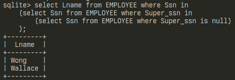
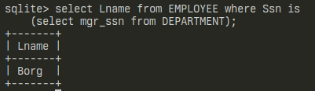
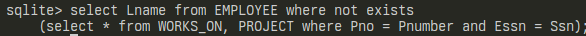

# vikublað 10 - gagnasafnsfræði

## 1.
```sql
select Lname from EMPLOYEE where Ssn in
    (select Ssn from EMPLOYEE where Super_ssn in
        (select Ssn from EMPLOYEE where Super_ssn is null)
    );
```
### keyrsla:


## 2.
```sql
select Lname from EMPLOYEE where Ssn is
    (select mgr_ssn from DEPARTMENT);
```
### keyrsla:


<div style='page-break-after: always;'></div>

## 3.
```sql
select Lname from EMPLOYEE where not exists
    (select * from WORKS_ON, PROJECT where Pno = Pnumber and Essn = Ssn);
```
### keyrsla:

engin útkoma úr keyrslu

## 4. 
```sql
select Fname, Lname from EMPLOYEE where not exists
    (select * from WORKS_ON where not exists
        (select * from PROJECT where Pno = Pnumber and Ssn = Essn)
    );
```
### keyrsla:

engin útkoma úr keyrslu