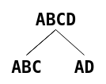

# gagnasafnsfræði - vikublað 5

## 1.
### a)
#### i.
þessi fallákveða gengur ekki upp sjá línu 4 og 5, fyrst stefnir `a0 -> b0` og svo stefnir `a0 -> b1` og það gengur ekki

#### ii.
þessi fallákveða gengur upp þar sem hún brýtur aldrei FD
- `b0 -> c1`
- `b1 -> c2`
- `b2 -> c4`
- `b3 -> c1`

#### iii.
fallákveða sem er viðsnúningur `ii.`, þessi gengur ekki þar sem í línum 2 og 4 bendir `c1 -> b2` en í línu 6 bendir `c1 -> b3` og það gengur ekki

#### iv.
þessi fallákveða gengur ekki upp og það eru fjórar línur sem brjóta hana
- fyrstu tvær línurnar sem brjóta eru lína 1 og þar sem `b2 -> a2` en svo lína 3 þar sem `b2 -> a4` og það gengur ekki
- seinni tvær línurnar eru lína 2 þar sem `b0 -> a3` og svo lína 4 þar sem `b0 -> a0` og það gengur ekki

#### v.
hérna er svipað dæmi og í `iv.` nema fleir línur sem brjóta, ég tel upp fyrstu tvær sem brjóta fallákveðuna, lína 1 þar sem `c4 -> a2` og svo lína 3 þar sem `c4 -> a4` og það gengur ekki

### b)
já `BC` er candidate key, þar sem hægt er að fá sérstaka dálka útfrá því að vera með bara þá 

## 2. 
athugum leiðingu fallákveðna:
- `BC` sem er superkey þar sem `BC+ = ABCDEFGHIJ`
- `B` sem er ekki superkey þar sem `B+ = ABEFJ`
- `C` sem er ekki superkey þar sem `C+ = CGHI`
- `G` sem er ekki superkey þar sem `G+ = GHI`
- `E` sem er ekki superkey þar sem `E+ 0 AJ`

þá er hægt að sjá að þar sem `BC` er eina superkey af þessum og það hefur enga undirlykla sem eru superkeys þá er `BC` candidate key

## 3.
### a)
allir mögulegir lyklar í R: 
- `AB+ = ABCD`
- `C+ = D`
- `D+ = A`  
það má sjá freakar að aðeins `AB` er yfirlykill og þessvegna eini sem kemur til greina sem lykill

yfirlyklar sem eru ekki mögulegir lyklar:  
eini yfirlykillinn er `AB` eb hann er mögulegur lykill 

### b)
allir mögulegir lyklar í R:  
- `A+ = ABCD`
- `B+ = BCD`
hérna er `A` eini yfirlykill þar sem `B` getur ekki leitt að `A`

yfirlyklar sem eru ekki mögulegir lyklar:  
`AB` er yfirlykill sem er ekki mögulegur lykill því hann leiðir að sjálfum sér , `B`

## 4. 
til að þátta `R(A,B,C,D)` með fallákveðunum `A -> B` og `B -> AC` í BCNF getur maður séð að lokun á `A`, `A+ = ABC`, nær yfir öll stök nema `D`  
ef við teiknum þetta upp má sjá dreifinguna  
  
þar sem vinstri hliðin táknar lokun á `A` og hægri hliðin er `A`, það sem við fundum lokun á, og restin sem var ekki í lokuninni  
þessi þáttun er `BCNF` og vegna þess er hún líka `3NF` þar sem `BCNF` er í innri hring skilgreiningar en `3NF`